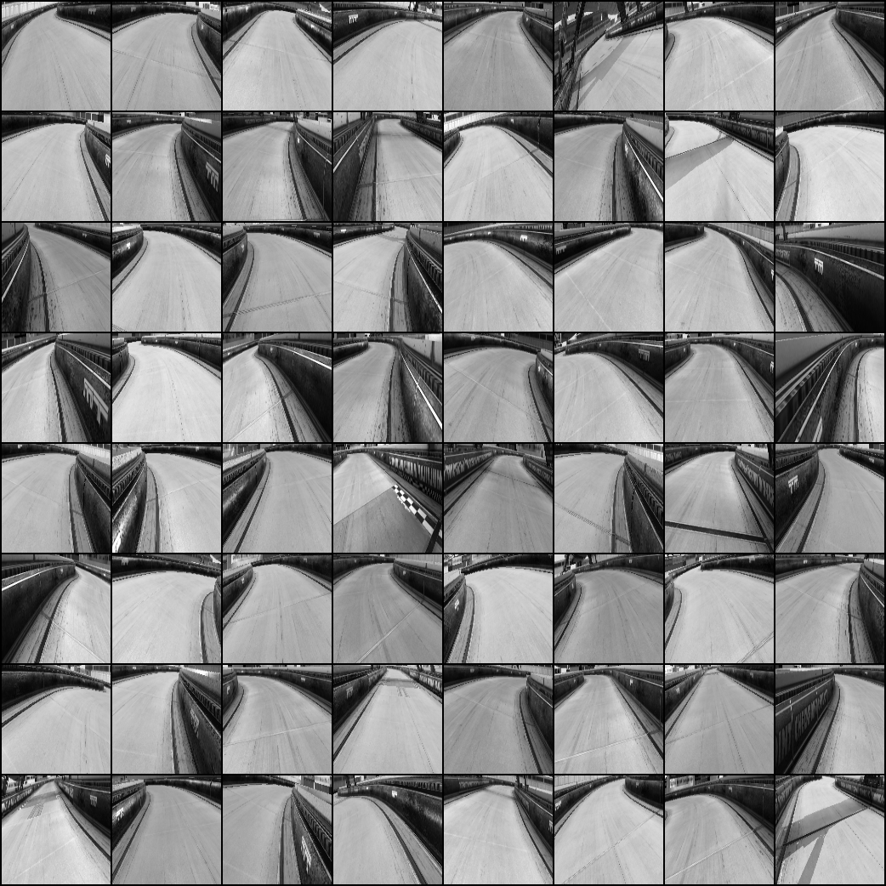
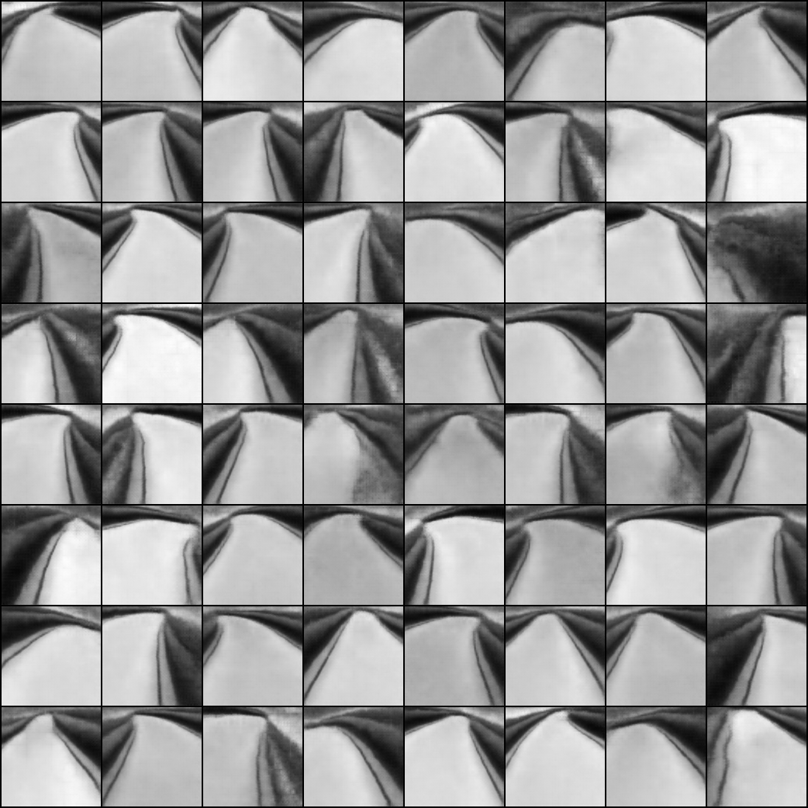
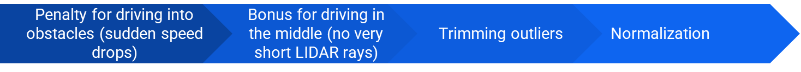
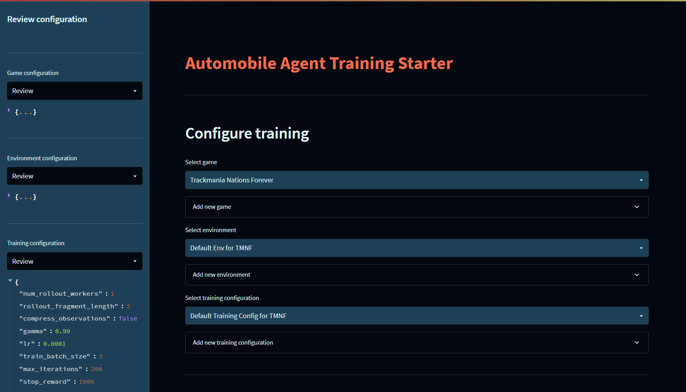
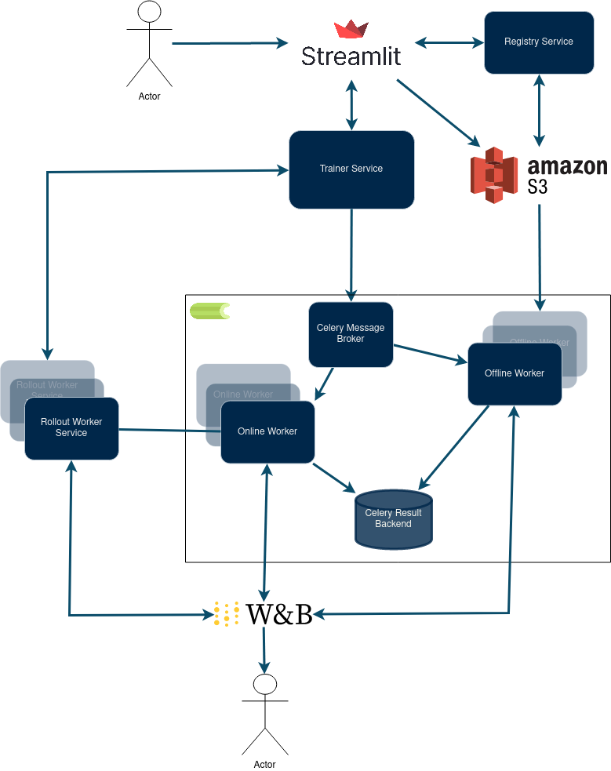

# Automobile Racing Toolbox

This project deals with the application of machine learning algorithms, in particular **reinforcement learning**, to train an agent in realistic racing simulators.

## Why does it work (well)?

Sample agent trained with this system:

### Advanced feature extraction (variational autoencoders)

Using variational autoencoders, we can significantly compress information about the image from the simulator, e.g. an image with a size of several hundred by several hundred pixels can be successfully cloned using a 16-element vector. Thanks to this, the neural network to be trained is much smaller, moreover, you can have a much larger reply buffer.

### Pararrell training enviroments

Probably the greatest acceleration of the training process was provided by the use of a parallel training environment, which is implemented using the [Ray RLlib](https://docs.ray.io/en/latest/rllib/index.html) framework. Thanks to this, the agent simultaneously trains on many racetracks, which is crucial especially in the initial phase of training, when his progress in reaching successive checkpoints is relatively slow.

### Adavanced reward function

The basis for the reward is the speed of the agent, read using OCR from the game simulator. The entire reward calculation process based on reward speed consists of the following elements:

This form of reward makes the agent avoid obstacles quite quickly.

## How to use?

From the user interface level, we select or create the configuration of the game interface (i.e. what kind of racing game is it, how to control the car in it, etc.), choose or create the configuration of the training environment (how observation, reward and whether the actions are discrete or continuous), select or we create a training configuration (algorithm and its parameters).

In addition, it is possible to track the progress of training (both agent and autoencoder) in the [Weights and Biases](https://wandb.ai/site) service. Every certain number of steps of the algorithm, short recordings of the agent's rides or image reconstructions in the case of autoencoders are saved. Lots of stats are also logged.

## How it works?

The system consists of:
- **Trainer Service** - the heart of the system. Through its API, you can run an agent or autoencoder training. It creates tasks using [Celery](https://docs.celeryq.dev/en/stable/)'s asynchronous queue. Tasks are offline or online. **Offline tasks** require training data in the form of recordings of rides (autoencoder training or behavior cloning). This data is fetched from [Amazon S3](https://aws.amazon.com/s3/). **Online task** uses one or more simulators wrapped in **Rollout Worker Service**. It contains algorithm instance and shares **policy server**.
- **Rollout Worker Service** (or Remote Worker Service) - wraps the racing simulator - takes an image from it, which is transformed by many methods into proper observation, and applies the agent's actions using a virtual keyboard (discrete actions) or a virtual controller (continuous actions). It contains the **policy client** of the reinforcement learning algorithm. This client asks **policy server** for action to execute, sending in the query the observation.
- **User interface** - web application created with the [Streamlit](https://streamlit.io/) framework. From its level, you can configure training and send a request to **Trainer Service** to run it.
- **Registry Service** - is responsible for access to the application. The OAuth 2.0 token granting system is used. After gaining access, the user is added to a special group of [AWS IAM](https://aws.amazon.com/iam/) users who have access. After the token expires, they are removed from it.

## Future plans

- Rewriting the UI with the React framework.
- Neural network for semantic segmentation of the road and other elements of the simulator.
- Optical flow for velocity vector approximation.
- Deploying of whole system on AWS.
